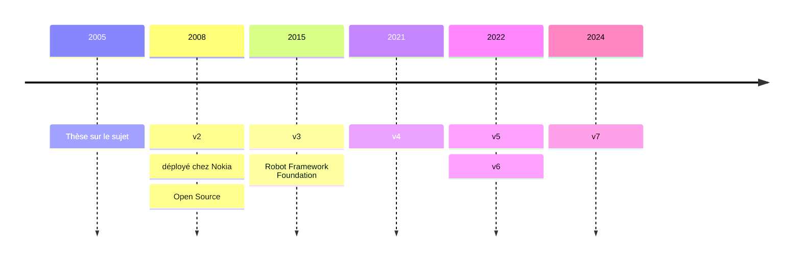
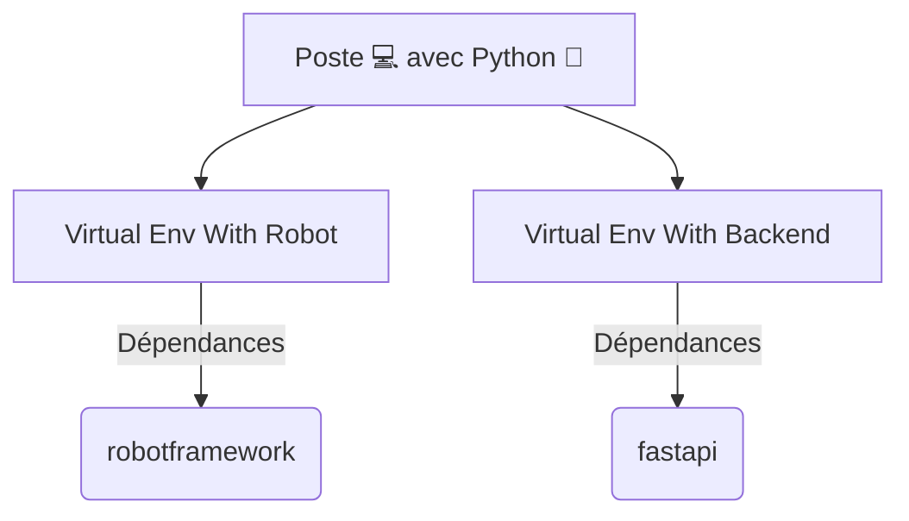
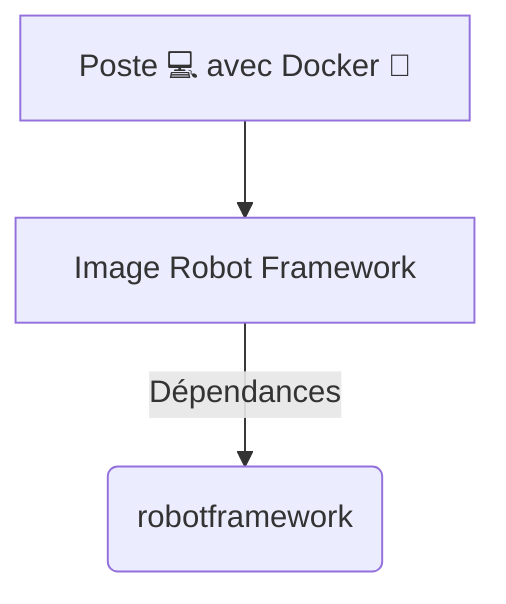
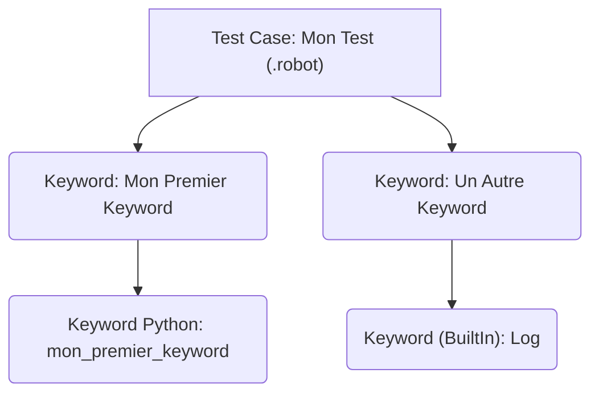

# Développer avec Robot Framework
### 22-23 Septembre 2025
##### Nickel NANTES
###### Rémi PICARD

---

## Tour de table

<v-clicks>

- Expérience dev
- Expérience testeur
- Expérience avec Robot Framework
- Attente vis à vis de cette formation ?

</v-clicks>

---
layout: two-cols
---

## Qui suis-je ?


<v-clicks>

- Rémi PICARD
- Dev Scala Cobalt
- 4 ans chez Nickel
- 4 ans d'expérience avec Robot Framework 🤖
- Passionné par les technos Web, Data et DevOps
- 13 ans d'expérience dans l'IT 👾
- Joueur d’échecs ♟

</v-clicks>

::right::


---
layout: center
---

# Jour 1
## Découverte de Robot Framework

<!-- TODO Fond d'écran -->

---

## Découverte de Robot Framework

<v-clicks>

- Généralités
- Installer l'env de dev
- Rappels Python
- Comprendre le fonctionnement de Robot Framework
- Découvrir la ligne de commande robot
- Ecrire mes premiers tests (codelab)

</v-clicks>

---

## Présentation

<v-clicks>

- Outil d’automatisation
- Langage
- Open Source codé en Python
- Fonctionnalités clefs en main (assertions, rapport de tests…)
- Extensible via des librairies RobotFramework (HTTP, JSON, SQL, Kafka …)
- Extensible via des librairies Python

</v-clicks>

---
layout: center
---

## Robot Framework => "Robot"
### RF / RBF / RBT

---

## Histoire
### 20 ans déjà !



---

## Communauté

<v-clicks>

- Slack
- RoboCon / RBCN : conférence annuelle à Helsinki 🇫🇮
- [Documentation](https://docs.robotframework.org/docs)

</v-clicks>


---
layout: center
---

# Env de dev 💻

---

## Installation
### Python Virtual Environment

<v-clicks>



[Python Virtual Environment](https://docs.robotframework.org/docs/getting_started/testing#install-robot-framework-in-a-virtual-environment)

</v-clicks>

---

## Installation
### Docker



---

## Installation
### PyCharm / VSCode

[Set up your IDE](https://docs.robotframework.org/docs/getting_started/ide)

---
layout: center
---

## Codelab 💻

- [Installation env de dév](https://remi-picard.github.io/robot-codelab/installation/)
- [Hello World](https://remi-picard.github.io/robot-codelab/hello-world/)
- [Configuration IDE](https://remi-picard.github.io/robot-codelab/configuration-ide/)

---
layout: center
---

# Développer avec Python 🐍
## Rappels

<!-- TODO Fond d'écran -->

---

## Types natifs

<v-clicks>

| Type         | Mot-clé    | Exemple                              |
|--------------|------------|--------------------------------------|
| **Entier**   | `int`      | `42`, `-17`, `0`                     |
| **Flottant** | `float`    | `3.14`, `2.5e-3`                     |
| **Booléen**  | `bool`     | `True`, `False`                      |
| **Chaîne**   | `str`      | `"Hello"`, `'World'`                 |
| **Tableau**  | `list`     | `["Hello", "World"]`                 |
| **Map**      | `dict`     | `{"key": "value", "key2": "value2"}` |
| **Aucun**    | `NoneType` | `None`                               |

</v-clicks>

<v-clicks>

[Documentation](https://docs.python.org/fr/3.13/library/stdtypes.html)

</v-clicks>
---

## Méthodes

```python{1-3|1-3,5|1-3,6|1-3,7|1-3,8|1-3,9}
def ma_fonction(arg1: int, arg2: str, default_arg="default", *args, **kwargs) -> int:
    # ...
    return 42

ma_fonction(42, "Quarente-deux")
ma_fonction(42, "Quarente-deux", "override default value")
ma_fonction(42, "Quarente-deux", "default", 1, 2, 3)
ma_fonction(42, "Quarente-deux", "default", robot="Nono", john="Doe")
ma_fonction(42, "Quarente-deux", "default", 1, 2, 3, robot="Nono", john="Doe")
```


---
layout: center
---

# Développer avec Robot Framework 🤖
## Tests, Variables, Keyword, Python ...

---

## Tests

<v-clicks>

- fichier `*.robot`
- indentation comme en Python 🐍
- ensemble de phrases 🪄
- Section `*** Test Cases ***`
- Import librairies dans `*** Settings ***`

</v-clicks>

---

## Tests
### Déclaration

```text {1-2|4-|all}
*** Settings ***
Library    String

*** Test Cases ***
Mon Premier Test
    ${chaine}=    Generate Random String    10
    Log    Hello ${chaine}
```

---


## Variables

<v-clicks>

- Même types qu'en Python 🐍
- Syntaxe `${...}` (comme en Bash)
- Création dans un Test ou Keyword
- Création en global dans la section `*** Variables ***`
- Import des variables Python possible

</v-clicks>

---

## Variables
### Déclaration

```text
*** Test Cases ***
Creation Variable
    ${ma_variable}    Set Variable    42
    Log    ma_variable=${ma_variable}
```

---

## Variables
### Import

```python
# resources/mes_variables_python.py

variable_python = 42
```

<br/>

<v-click>

```text {1,2|all}
*** Settings ***
Variables    resources/mes_variables_python.py

*** Test Cases ***
Creer Variable
    Log    variable_python=${variable_python}
```

</v-click>

---

## Variables
### Section Variables

```text {1-5|all}
*** Variables ***
${nombre}    42
${chaine}    Ma chaîne de caractères
@{tab}       1  2  3
&{map}       clef1=valeur1  clef2=valeur2

*** Test Cases ***
Teste Variables
    Log    nombre=${nombre}
    Log    chaine=${chaine}
    Log    tab=${tab}
    Log    map=${map}
```

---

## Injection Python 🐍
### Evaluate

```text {1-4|6-8}
*** Test Cases ***
Teste Evaluate
    ${nb}=    Evaluate    41 + 1
    Log    nb=${nb}

Teste Evaluate Autre Syntaxe
    ${nb}=    Set Variable    ${{41 + 1}}
    Log    nb=${nb}
```

---

## Keyword
### Concept

<v-clicks>

- Ensemble de mots clés (séparés par 1 espace)
- Forme une phrase 🪄
- Représente une **action** 🕹️
- Déclaré dans la section `*** Keywords ***`
- Robot Framework traduit les phrases en appels Python 🐍

</v-clicks>

---

## Keyword
### Syntaxe Robot Framework

```text {1|1-3|1,5-7|1,9-12}
*** Keywords ***
Mon Premier Keyword
    Log    Hello World
    
Mon Premier Keyword Avec Argument
    [Arguments]    ${name}
    Log    Hello ${name}
    
Mon Premier Keyword Avec Argument Et Return
    [Arguments]    ${name}
    Log    Hello ${name}
    RETURN    42
```

---

## Keyword
### Arg dans Keyword

```text {1-3|1,5-7|all}
*** Keywords ***
Keyword Avec ${arg1} Intégré
    Log    Hello ${arg1}
    
Keyword Avec ${arg1} Intégré Et Arguments
    [Arguments]    ${name}
    Log    Hello ${arg1}, ${name}
    
*** Test Cases ***
Appel Keywords
    ${arg1}    Set Variable    Ma Variable
    Keyword Avec ${arg1} Intégré  
    Keyword Avec ${arg1} Intégré Et Arguments    Arg2
```

---

## Keyword
### List (args) / Dict (kwargs)

```text {1-6|1,8-12|all}
*** Keywords ***
Keyword Avec Args
    [Arguments]    @{list}
    FOR  ${i}  IN  @{list}
        Log    i=${i}
    END

Keyword Avec Kwargs
    [Arguments]    &{map}
    FOR  ${k}  ${v}  IN  &{map}
        Log    key=${k}, value=${v}
    END

*** Test Cases ***
Appel Keywords
    ${list}    Create List  1  2  3
    Keyword Avec Args    ${list}

    ${map}    Create Dictionary    cle1=valeur1  cle2=valeur2
    Keyword Avec Kwargs    &{map}
```

---

## Keyword
### Gestion des espaces

<v-clicks>

- **1 espace** entre chaque mot
- **2 espaces ou +** (ou **tabulation**) entre chaque argument

</v-clicks>

<br>

<v-click>


</v-click>


<!-- TODO Lien vers doc RBF avec tableau -->

---

## Keyword
### Gestion des chaînes

- inutile de mettre des `"` ou des `'` autour des chaînes de caractère

---

## Keyword
### Appel

```text {1|1-3|1-2,4|1-2,5|7-9}
*** Test Cases ***
Mon Premier Test
    Mon Premier Keyword
    Mon Premier Keyword Avec Argument    Nono le petit robot
    ${retour}=    Mon Premier Keyword Avec Argument Et Return    Terminator

*** Keywords ***
Mon Deuxième Keyword
    Mon Premier Keyword
```

---

## Keyword
### Syntaxe Python

```python {1-3|5-8}
# Mon Premier Keyword
def mon_premier_keyword():
    print("Hello World")
    
# Mon Premier Keyword Avec Argument Et Return    ${name}
def mon_premier_keyword_avec_argument_et_return(name) -> int:
    print(name)
    return 42
```


<!-- TODO Exemples à revoir -->
<!-- TODO Slide Suite de tests -->
<!-- TODO Schéma mermaid imbrications Keyword -->
<!-- TODO Ajouter schéma (poupées rousses avec des robots) -->

---

## Test -> Keyword -> Keyword

<br>



---

## Section

<v-clicks>

- `*** Settings ***` : imports librairies / ressources / variables
- `*** Test Cases ***` : déclarations Tests
- `*** Keywords ***` : déclarations Keywords
- `*** Variables ***` : déclarations Variables

</v-clicks>

---

## Ligne de commande `robot`

```bash {1|3-4|6-7|all}
robot --help

# Lance tous les tests présents dans le dossier tests
robot tests

# Lance le test "Mon Test"
robot -t "Mon Test" tests
```

---

## Résultats

<v-clicks>

- `report.html` : synthèse
- `log.html` : détails par tests et keywords
  - 🔴 ERROR => automatiquement affiché (avec focus sur le keyword en erreur)
  - 🟢 SUCCESS
- `output.xml` / `xunit.xml` : sortie technique pour intégration continue / outils

</v-clicks>

---

## Résultats
### log.html

TODO Capture d'écran


---
layout: center
---

## Quizz

TODO Klaxoon ?


---
layout: center
---

## Codelab 💻

Tester les syntaxes

- Keyword
- Test
- Variable

---

## RequestsLibrary

- Tests d'API
- Wrapper de la lib Python requests
- [Documentation](https://docs.robotframework.org/docs/different_libraries/requests)

---

## RequestsLibrary

```text {1-2|-6|1-2,8-9|1-2,11-|all}
*** Settings ***
Library               RequestsLibrary

*** Test Cases ***
Quick Get Request Test
    ${response}=    GET  https://www.google.com

Quick Get Request With Parameters Test
    ${response}=    GET  https://www.google.com/search  params=query=ciao  expected_status=200

Quick Get A JSON Body Test
    ${response}=    GET  https://jsonplaceholder.typicode.com/posts/1
    Should Be Equal As Strings    1  ${response.json()}[id]
```

---
layout: center
---


## Codelab 💻

[API Booker](https://remi-picard.github.io/robot-codelab/api-booker/)


---
layout: center
---


# Jour 2
## Bonnes pratiques et Industrialisation

<!-- TODO Fond d'écran -->

<!-- TODO Slide sur JSON -->
<!-- TODO Slide sur Playwright -->
<!-- TODO Slide sur listener -->
<!-- TODO Ajouter video d'intro -->
<!-- TODO Template Jinja -->
<!-- TODO Test avec Fichiers -->
<!-- TODO Pre Commit + Robotidy -->
<!-- TODO Black -->
<!-- TODO Toolkit -->
<!-- TODO libtoc, libdoc, Documentation -->
<!-- TODO Pyramide des tests -->
<!-- TODO Tests quotidiens -->
<!-- TODO Notifications GChat -->
<!-- TODO API Python (Listener) -->
<!-- TODO Terminal interactif -->
<!-- TODO Revoir le plan, à simplifier, mettre en cohérence avec les titres des slides -->
<!-- TODO Pyramide des tests -->
<!-- TODO Tests quotidiens -->
<!-- TODO Notifications GChat -->
<!-- TODO API Python (Listener) -->
<!-- TODO Terminal interactif -->

---

## Bonnes pratiques Robot Framework

<v-clicks>

- Organiser les tests et les ressources
- Utiliser les librairies standards de Robot Framework
- Découvrir les syntaxes avancées
- Ecrire des tests robustes
- Découvrir les outils autour de Robot Framework
- Mettre en place une intégration continue

</v-clicks>

---

## Organiser les tests et les ressources
### Structure standard d'un projet

<!-- TODO Variable d'env (.env ou YAML) -->

<v-clicks>

- `tests/` : fichiers de tests (`.robot`).
- `resources/` : keywords partagés, variables et librairies maison (`.resource`, `.py`).

</v-clicks>

<br>

<v-clicks>

```text
mon-projet/
├── tests/
│   └── cas_de_test.robot
├── resources/
│   └── keyword_communs.resource
│   └── ma_librairie.py
```

</v-clicks>

<br>

<v-clicks>

[RobotFramework - Project Structure](https://docs.robotframework.org/docs/examples/project_structure)

</v-clicks>

---

## Ligne de commande `robot`

```bash {1-2|4-5|all}
# Vérifie la syntaxe de tous les tests
robot --dryrun tests

# Ajoute le répertoire courant dans le PYTHON PATH
robot --pythonpath . tests
```

---

## PYTHON PATH

<v-clicks>

<section>

Sans `--pythonpath` :

```text
*** Settings ***
Resource    ../resources/ma_lib.resource

*** Test Cases ***
Tester Ma Lib
    Mon Keyword
```

</section>

<section>

Avec `--pythonpath .` :

```text
*** Settings ***
Resource    resources/ma_lib.resource

*** Test Cases ***
Tester Ma Lib
    Mon Keyword
```

</section>

</v-clicks>

---

## Librairies standards
### Boîte à outils intégrée

<!-- TODO A compléter -->
<!-- TODO Ajouter slides autres librairies -->

<v-clicks>

- **`BuiltIn`** : incontournables (`Log`, `Set Variable`, `Run Keyword If`, `Sleep`...)
- **`String`** : chaînes de caractères
- **`Collections`** : listes et dictionnaires

</v-clicks>

---

## Écrire des tests robustes
### Gérer l'asynchronisme

<v-clicks>

- **Problème** : Les éléments d'une page web n'apparaissent pas instantanément.
- **Anti-pattern** : `Sleep` -> attente fixe, fragile et qui ralentit les tests.
- **Solution** : `Wait Until Keyword Succeeds` -> boucle d'attente intelligente.

</v-clicks>

<br>

<v-click>

```text
*** Test Cases ***
Attendre un élément
    Wait Until Keyword Succeeds    10s    1s    Page Should Contain    Bienvenue
```

</v-click>

<!-- TODO Playwright (attente by design) -->

---

## Outils autour de Robot Framework

<!-- TODO MockServer -->
<!-- TODO A compléter -->
<!-- TODO Usages (création de données, prototype, tests manuels) -->

<v-clicks>

- **`RequestsLibrary`** : Tests d'API REST.
- **`JSON`**

</v-clicks>


---

## Intégration continue

<!-- TODO A compléter -->
<!-- TODO robotdiff -->
<!-- TODO Tasks / RPA -->
<!-- TODO rebot -->
<!-- TODO Gitlab CI VS Déploiement dans k8s -->
<!-- TODO Browser Library -->
<!-- TODO Lire la documentation -->

<v-clicks>

- **Principe** : Exécuter les tests automatiquement à chaque `push` sur le dépôt Git
- **Exemple avec Gitlab CI** : Un fichier `.gitlab-ci.yml` qui lance la commande `robot`
- **Artefacts** : Publier les rapports HTML pour chaque pipeline

</v-clicks>

---
layout: center
---

# Questions & Réponses

<v-clicks>

- Merci pour votre attention.
- Bonne chance pour l'automatisation de vos tests !
- Amusez-vous bien !

</v-clicks>
